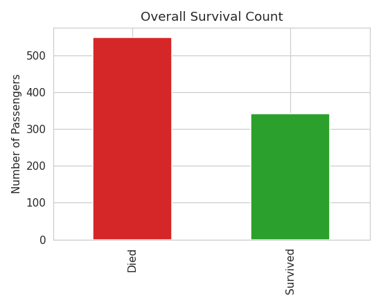
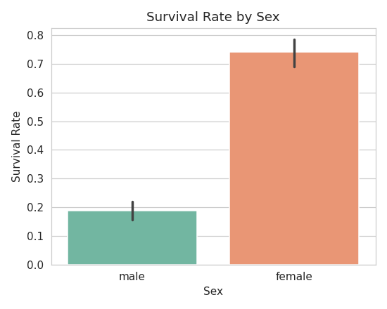
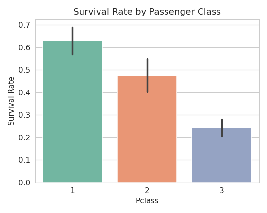
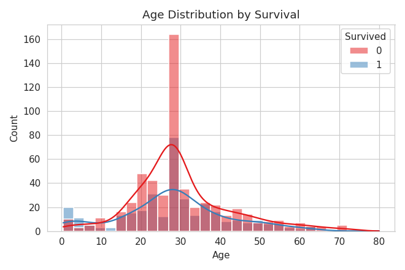
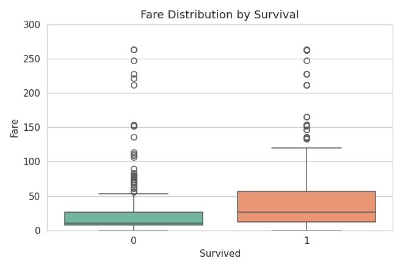
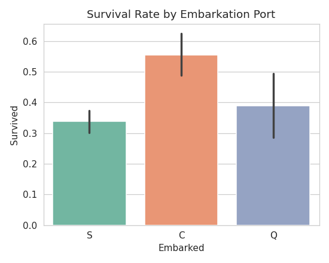
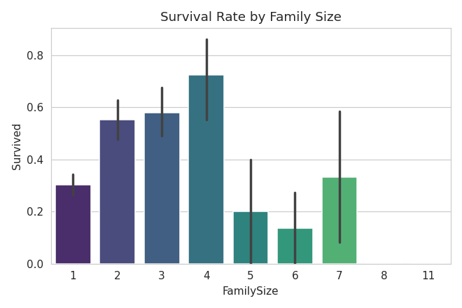
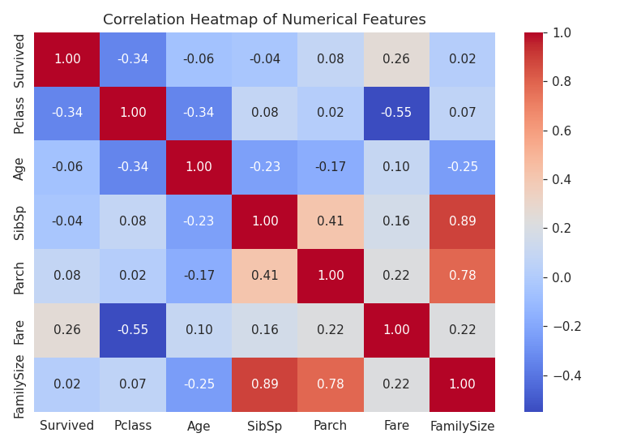
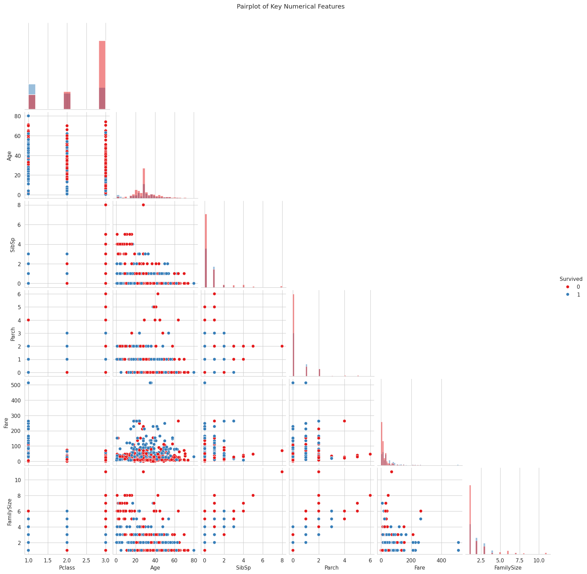

# Exploratory Data Analysis Report — Titanic Dataset

## 1. Introduction

This report presents an exploratory data analysis (EDA) of the Titanic passenger
dataset (891 records). The goal is to uncover patterns and trends related to
passenger survival using statistical summaries and visualizations, and to identify
the key factors that influenced who survived and who did not.

## 2. Dataset Overview

| Property | Value |
|---|---|
| Records | 891 |
| Columns | 12 |
| Target variable | `Survived` (0 = Died, 1 = Survived) |
| Overall survival rate | 38.4% |

**Missing values identified:**
- `Cabin`: 687 missing (~77%) — too sparse to use reliably, excluded from analysis.
- `Age`: 177 missing (~20%) — imputed with the median age.
- `Embarked`: 2 missing — imputed with the most frequent port (Southampton).

## 3. Statistical Summary

- Average age: ~29.7 years (median 28, after imputation).
- Average fare: $32.20, but heavily right-skewed (max $512.33) — a small number of
  very wealthy passengers pull the mean above the median ($14.45).
- Passenger class distribution: 3rd class was the largest group (~55% of passengers),
  followed by 1st (~24%) and 2nd (~21%).

## 4. Visual Analysis

### 4.1 Overall Survival

Most passengers (61.6%) did not survive — a sobering baseline for all subsequent
comparisons.

### 4.2 Survival by Sex

Women survived at roughly **74%**, compared to **19%** for men. This is the single
strongest behavioral driver in the dataset, consistent with the historical
"women and children first" evacuation protocol.

### 4.3 Survival by Passenger Class

Survival rate dropped steadily by class: 1st class (~63%) → 2nd class (~47%) →
3rd class (~24%). Class likely correlates with cabin proximity to lifeboats and
crew priority during evacuation.

### 4.4 Age Distribution by Survival

Young children show a visibly higher survival density, while the broad adult
age range (20–40) — the largest passenger segment — had a lower survival rate.

### 4.5 Fare vs Survival

Survivors paid noticeably higher fares on average, reinforcing the class-based
survival pattern: fare is effectively a continuous proxy for socioeconomic status.

### 4.6 Survival by Embarkation Port

Passengers boarding at Cherbourg (C) had a higher survival rate than those from
Southampton (S) or Queenstown (Q) — largely explained by Cherbourg having a higher
proportion of 1st class passengers rather than the port itself being causal.

### 4.7 Survival by Family Size

Passengers traveling with a small family (2–4 total members) had better odds than
those traveling completely alone or in very large family groups (5+), possibly
reflecting mutual assistance versus the difficulty of coordinating large groups
during evacuation.

### 4.8 Correlation Heatmap

| Feature | Correlation with Survival |
|---|---|
| Fare | +0.26 |
| Parch | +0.08 |
| FamilySize | +0.02 |
| SibSp | -0.04 |
| Age | -0.06 |
| Pclass | **-0.34** |

`Pclass` shows the strongest correlation magnitude among numeric features
(negative, since class 1 is "better" but numerically lower), confirming
socioeconomic status as a primary influencing factor.

### 4.9 Pairwise Relationships

The pairplot reinforces the class/fare relationship (visible inverse curve between
`Pclass` and `Fare`) and shows survivors (orange) clustering toward lower `Pclass`
and higher `Fare` values across multiple feature pairs.

## 5. Key Influencing Factors (Ranked)

1. **Sex** — the dominant factor; far larger effect size than any numeric correlation.
2. **Passenger Class / Fare** — strong, consistent secondary driver tied to
   socioeconomic status.
3. **Age** — children had a moderate survival advantage.
4. **Family Size** — moderate family size was protective relative to extremes.
5. **Embarkation Port** — weak, likely confounded by class composition rather than
   a direct cause.

## 6. Conclusion

Survival aboard the Titanic was not random — it followed clear, explainable
patterns rooted in **social norms** (women and children prioritized) and
**socioeconomic stratification** (wealthier, higher-class passengers had better
access to lifeboats). This analysis demonstrates how structured EDA — combining
statistical summaries, univariate/bivariate visualizations, and correlation
analysis — can reveal the underlying drivers of an outcome in a real-world dataset.

## 7. Tools & Methodology

- **Language/Libraries:** Python, pandas, NumPy, Matplotlib, Seaborn
- **Process:** Data loading → missing value inspection → cleaning/imputation →
  feature engineering (`AgeGroup`, `FamilySize`) → univariate analysis → bivariate
  analysis → correlation analysis → insight synthesis
- **Reproducibility:** All charts in this report are generated by
  `notebooks/EDA_Titanic.ipynb` (or `run_analysis.py`), runnable end-to-end.
